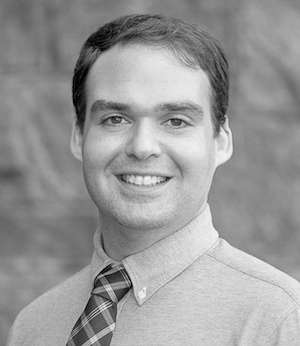

<dl class="captioned-img alignright" style="max-width:260px">
  
  <dt></dt>
  
</dl>

I am an Associate Professor and Chair of the Undergraduate Program in [Philosophy at the University of Pennsylvania](http://philosophy.sas.upenn.edu/). I research **epistemology (including traditional, formal, and social epistemology)**, **the nature of normativity in ethics and epistemology**, and **social philosophy** with an emphasis on **diversity** and **polarization**. 

I have a secondary appointment as an Associate Professor of [Legal Studies and Business Ethics in the Wharton School of Business](https://lgst.wharton.upenn.edu/). During the Spring quarter of 2018, I was a [Fellow of the Dartmouth Institute for Cross Disciplinary Engagement](http://ice.dartmouth.edu/fellows-program/daniel-singer).

A large part of [my research](http://www.danieljsinger.com/research/) is about what we should believe, both as individuals and as groups. I recently finished writing book titled _Right Belief and True Belief_ that's under contract with Oxford University Press. The book argues for a general truth-loving epistemic consequentialist theory of what we should believe. The view says we should believe (but also set up groups, use decision-making procedures, arrange access to schooling, etc.) so as to promote having more true belief. 

Another large part of my [my research](http://www.danieljsinger.com/research/) is about diversity and its effects on group deliberation and problem-solving. Most of this research is done with the [Computational Social Philosophy Lab](/CSPL/), an interdisciplinary and international research group that takes an empirically-informed approach to using agent-based computer models to investigate questions in social epistemology, political philosophy, and philosophy of science. Most of the group's work focuses on topics like diversity and polarization in groups, the nature of expertise, how the structure of groups (like scientific lab groups) affects what information the group receives, how democracies can improve or hinder information flow, and how groups like juries can be better constructed to achieve their aims. 

Conferences I organize:  
[Penn Reasons and Foundations in Epistemology Conference (PeRFECt)](http://www.danieljsinger.com/PeRFECt5/)  
[Penn-Rutgers-Princeton Social Epistemology Workshop (PRPSEW)](http://www.danieljsinger.com/PRPSEW/)

Before coming to Penn, I did a Ph.D. in Philosophy at the [University of Michigan](http://www.lsa.umich.edu/philosophy/). I started at Penn as an Assistant Professor in January of 2013, and I received tenure and a promotion to Associate Professor in July 2019.

When I'm not working, I like to run and take <a target="_blank" href="https://www.instagram.com/philosophydan/">pictures of birds  </a>.

<h2>Contact Me:</h2>

  

    

    
<b>Physical Mail:</b> 
      Department of Philosophy 
      433 Cohen Hall 
      Philadelphia, PA 19104-6304

    

    

      
<b>Email:</b> <a href="mailto:singerd@phil.upenn.edu">singerd@phil.upenn.edu</a>

       
      
<b>Office:</b> 461 <a href="http://www.facilities.upenn.edu/maps/locations/cohen-hall-claudia">Cohen Hall</a>

    

    

      
<b>Phone:</b> +1 920-4Singer

       
      
<a href="http://www.danieljsinger.com/anonmessage/">Send Me an Anonymous Message</a>

    

  

